# 📈 Rossmann Store Sales Prediction

<p align="center">


</p>

<p align="center">
<b>End-to-end machine learning regression project for predicting daily sales for Rossmann stores.</b>
</p>

---

## 📌 Project Overview

This project develops a machine learning regression system to predict **daily store sales** using historical sales records, customer information, promotions, store information, and calendar-related features.

The complete workflow covers:

**Data Exploration → Data Cleaning → Feature Engineering → Model Training → Model Evaluation → Model Selection → Model Export → Streamlit Deployment**

The final deployment model is a **Random Forest Regressor**. The Streamlit application supports both single-record and batch sales prediction.

---

## 🎯 Objective

The primary objective is to build a robust regression model that can estimate daily sales for a store based on operational and calendar information.

The model uses:

- 🏪 Store ID
- 📅 Day of Week
- 🗓️ Date-derived calendar features
- 👥 Customers
- 🎯 Promotion status
- 🏖️ Holiday information
- 📊 Historical store-average sales

### Business Rule

A closed store cannot generate sales:

```text
Open = 0  →  Sales = 0
Open = 1  →  Random Forest prediction
```

The model is therefore trained only on **open-store observations**, while closed-store predictions are explicitly set to zero.

---

# 📊 Dataset

The dataset used by the notebook contains:

| Property         |                        Value |
| ---------------- | ---------------------------: |
| Records          |                **1,017,209** |
| Original Columns |                        **9** |
| Missing Values   |                        **0** |
| Duplicate Rows   |                        **0** |
| Date Range       | **2013-01-01 to 2015-07-31** |

### Original Features

| Feature         | Description                   |
| --------------- | ----------------------------- |
| `Store`         | Store identification number   |
| `DayOfWeek`     | Day of the week               |
| `Date`          | Sales date                    |
| `Sales`         | Target variable — daily sales |
| `Customers`     | Number of customers           |
| `Open`          | Store open/closed indicator   |
| `Promo`         | Promotion indicator           |
| `StateHoliday`  | State holiday indicator       |
| `SchoolHoliday` | School holiday indicator      |

---

# 🔎 Exploratory Data Analysis

The exploratory analysis examines sales distribution, customer-sales relationships, weekly patterns, promotion effects, store operating status, and feature correlations.

## 💰 Sales Distribution

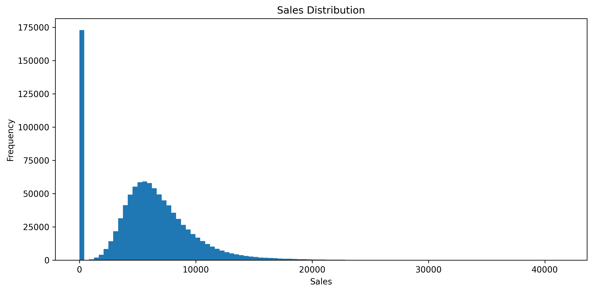

The distribution shows the overall range and frequency of daily sales observations.

---

## 👥 Sales vs Customers

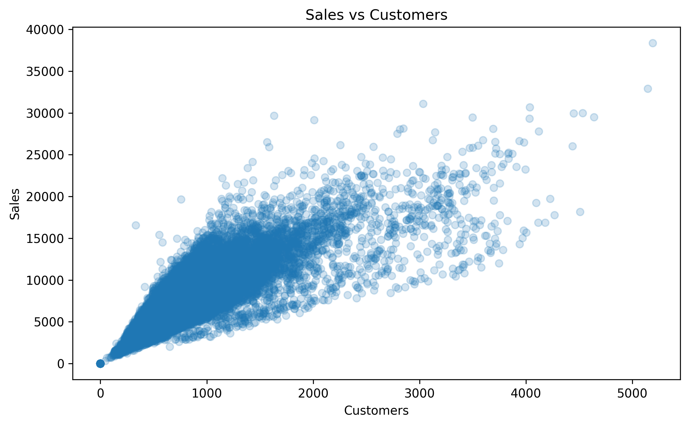

The scatter plot shows the relationship between the number of customers and daily sales.

---

## 📅 Average Sales by Day of Week

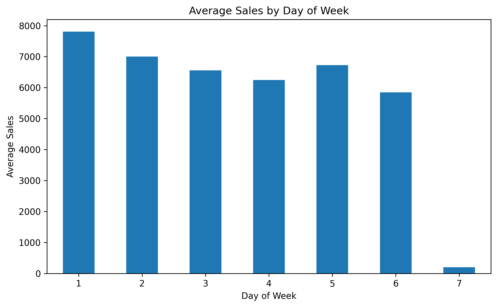

This plot compares the average sales across the seven days of the week.

---

## 🎯 Promotion Effect

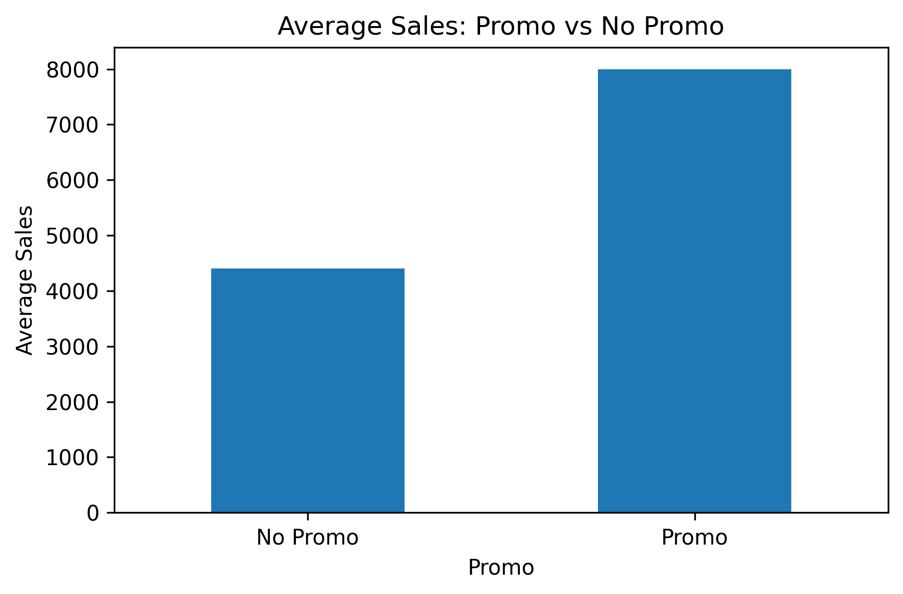

Comparison of average sales for days with and without an active promotion.

---

## 🏪 Store Open vs Closed

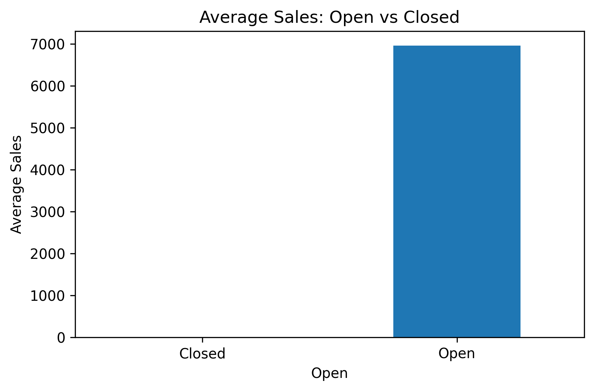

Comparison of average sales for open and closed stores.

---

## 🔥 Feature Correlation

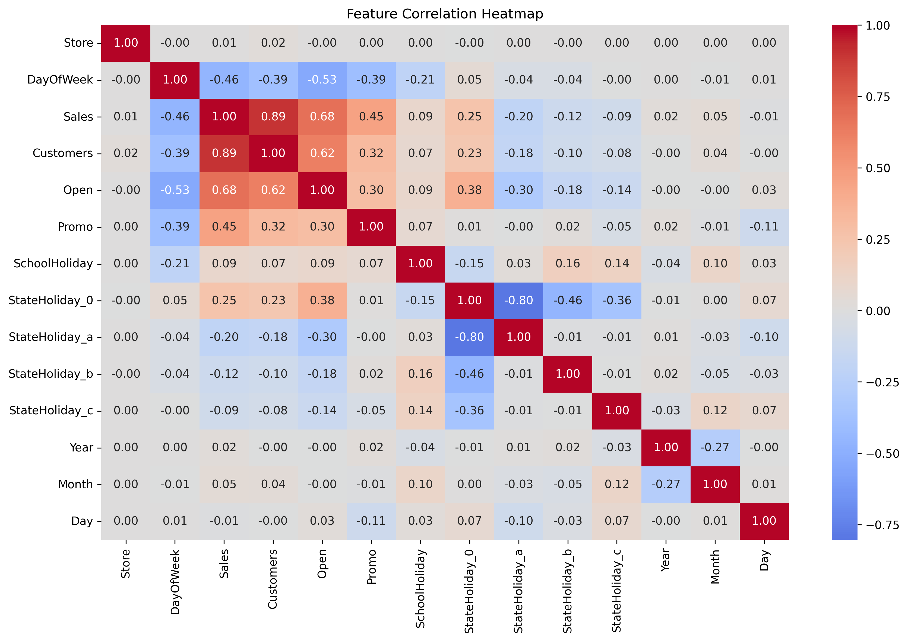

The correlation heatmap provides an overview of relationships between numerical variables.

---

# ⚙️ Feature Engineering

Calendar and historical features were created to improve the model's ability to capture sales patterns.

### Engineered Features

| Feature         | Description                                   |
| --------------- | --------------------------------------------- |
| `Year`          | Year extracted from `Date`                    |
| `Month`         | Month extracted from `Date`                   |
| `Day`           | Day of month                                  |
| `WeekOfYear`    | ISO week number                               |
| `Quarter`       | Calendar quarter                              |
| `DayOfYear`     | Day number within the year                    |
| `IsWeekend`     | Weekend indicator                             |
| `StoreAvgSales` | Training-derived average sales for each store |

### Final Model Features

The final Random Forest model uses:

```text
Customers
StoreAvgSales
Promo
Store
DayOfWeek
DayOfYear
Day
WeekOfYear
Year
Month
```

---

# 🧪 Data Splitting Strategy

The notebook uses a **chronological split** rather than a random train-test split.

| Dataset           |     Records | Description                       |
| ----------------- | ----------: | --------------------------------- |
| Training          | **700,000** | Used for model training           |
| Evaluation        | **200,000** | Used for model evaluation         |
| Live / Production | **117,209** | Final production-style evaluation |

For training, only the **580,096 open-store records** are used.

The evaluation dataset contains **32,680 closed-store records**, while the live dataset contains **20,233 closed-store records**.

---

# 🤖 Machine Learning Models

Two regression algorithms were trained and evaluated:

### 1. Random Forest Regressor

An ensemble of decision trees capable of learning nonlinear relationships between customers, store characteristics, promotions, and calendar features.

Configuration used in the notebook:

```text
n_estimators = 100
max_depth = 20
random_state = 42
n_jobs = -1
```

### 2. Gradient Boosting Regressor

`HistGradientBoostingRegressor` was evaluated as an alternative tree-based regression model.

Configuration used in the notebook:

```text
max_iter = 200
learning_rate = 0.1
max_leaf_nodes = 31
random_state = 42
```

---

# 📈 Model Performance

The models were evaluated using:

- **MAE** — Mean Absolute Error
- **RMSE** — Root Mean Squared Error
- **R²** — Coefficient of Determination

## Model Comparison

| Model                |        MAE |       RMSE |   R² Score |
| -------------------- | ---------: | ---------: | ---------: |
| 🏆 **Random Forest** | **418.58** | **670.47** | **0.9667** |
| Gradient Boosting    |     549.20 |     829.66 |     0.9490 |

### R² Comparison

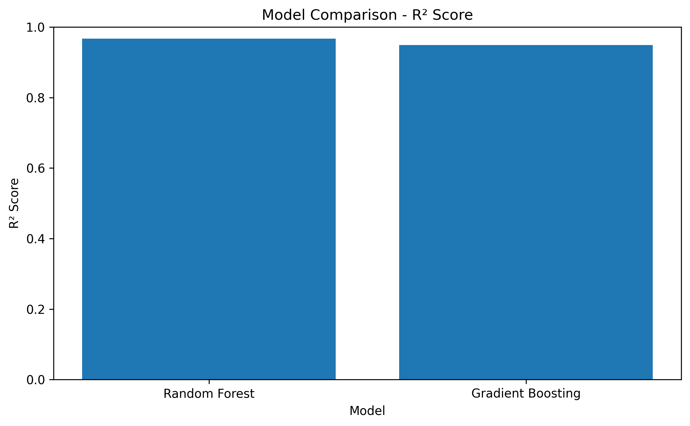

### Error Comparison

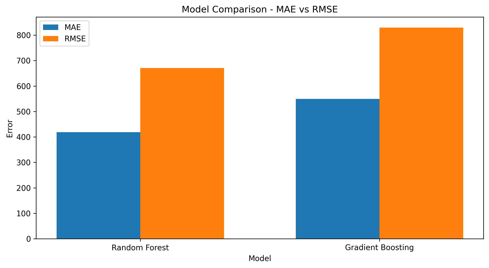

## 🏆 Selected Model: Random Forest

Random Forest was selected for deployment with an evaluation:

```text
MAE  = 418.58
RMSE = 670.47
R²   = 0.9667
```

Random Forest was selected for deployment because it provided the better evaluation performance and exposes `feature_importances_`, which is also displayed in the Streamlit model-information page.

---

# 🌲 Feature Importance

The final Random Forest model shows the relative contribution of the selected features.

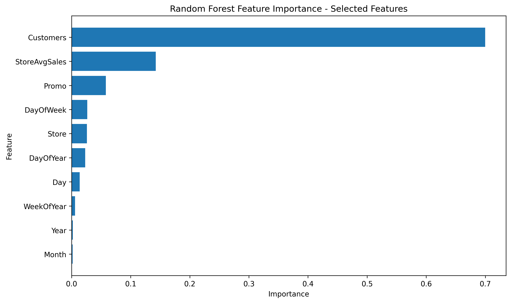

### Feature Importance Values

| Feature         | Importance |
| --------------- | ---------: |
| `Customers`     |   0.699889 |
| `StoreAvgSales` |   0.142517 |
| `Promo`         |   0.058061 |
| `DayOfWeek`     |   0.026638 |
| `Store`         |   0.026047 |
| `DayOfYear`     |   0.023111 |
| `Day`           |   0.013873 |
| `WeekOfYear`    |   0.005836 |
| `Year`          |   0.002109 |
| `Month`         |   0.001919 |

**Customers** is the dominant feature in the final Random Forest model, followed by `StoreAvgSales` and `Promo`.

---

# 🎯 Actual vs Predicted Sales

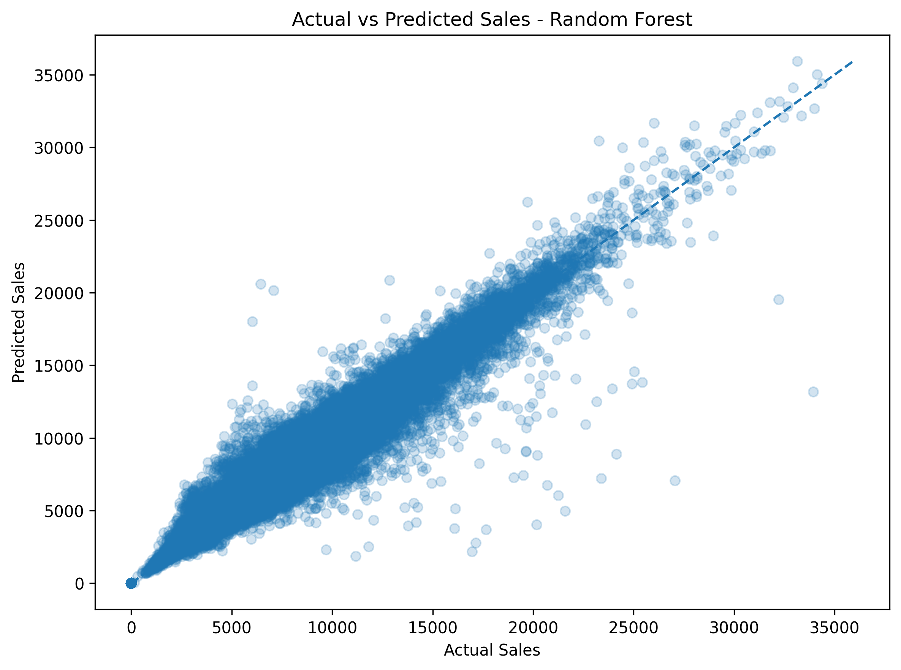

The actual-versus-predicted plot compares model predictions against observed sales values for the evaluation dataset.

The notebook also verifies the closed-store business rule:

```text
Closed-store predictions that are not zero: 0
```

---

# 📉 Residual Analysis

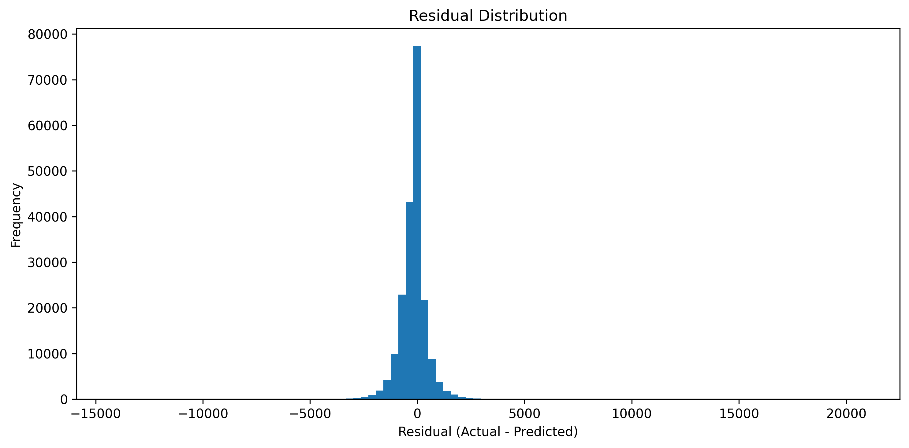

Residuals are calculated as:

```text
Residual = Actual Sales − Predicted Sales
```

Evaluation residual statistics:

| Metric     |       Value |
| ---------- | ----------: |
| Mean Error | **-154.11** |
| MAE        |  **418.58** |
| RMSE       |  **670.47** |

---

# 🏭 Live / Production Evaluation

The final model was additionally evaluated on the live/production portion of the chronological dataset.

| Metric                      | Live / Production |
| --------------------------- | ----------------: |
| Records                     |       **117,209** |
| MAE                         |        **401.22** |
| RMSE                        |        **665.60** |
| R²                          |        **0.9677** |
| Closed Predictions Non-Zero |             **0** |

This evaluation also confirms that the closed-store business rule is maintained in the production-style prediction workflow.

---

# 🌐 Streamlit Application

The trained model is integrated into an interactive **Streamlit web application**.

The application provides three sections:

### 🔮 Single Prediction

Users can enter:

- Store ID
- Date
- Customers
- Day of Week
- Store Open status
- Promo status
- School Holiday status
- State Holiday status

The application then returns the predicted sales.

### 📂 Batch Prediction

Users can upload a CSV containing:

```text
Store
DayOfWeek
Date
Customers
Open
Promo
StateHoliday
SchoolHoliday
```

The application generates a `PredictedSales` column and provides a downloadable CSV.

### 📊 Model Information

The application displays:

- MAE
- RMSE
- R²
- Training / evaluation / live record counts
- Selected features
- Random Forest feature importance

---

# 🧠 Prediction Workflow

```text
                         User Input / CSV
                                │
                                ▼
                       Input Validation
                                │
                                ▼
                     Date Preprocessing
                                │
                                ▼
                    StateHoliday Encoding
                                │
                                ▼
                     Calendar Features
                                │
                                ▼
                     StoreAvgSales
                                │
                                ▼
                    ┌───────────┴───────────┐
                    │                       │
                Open = 0               Open = 1
                    │                       │
                    ▼                       ▼
                Sales = 0          Random Forest Model
                                            │
                                            ▼
                                   Predicted Sales
```

---

# 📁 Project Structure

```text
Predicting-Sales-for-Different-Stores/
│
├── 📄 README.md
├── 🐍 app.py
└── 📓 predicting_sales_final.ipynb
```

### Documentation

| File                           | Purpose                                                                                          |
| ------------------------------ | ------------------------------------------------------------------------------------------------ |
| `README.md`                    | Project overview, methodology, results, plots, and deployment instructions                       |
| `app.py`                       | Streamlit web application                                                                        |
| `predicting_sales_final.ipynb` | Complete data processing, EDA, feature engineering, model training, evaluation, and model export |

---

# 📦 Model File

The trained model is exported as:

```text
sales_model.pkl
```

The PKL contains the trained Random Forest model, exact model features, training-derived store averages, evaluation metrics, split sizes, business-rule settings, and feature importance.

The file is **not included in this GitHub repository** because the generated model is approximately **344 MB**, which exceeds GitHub's standard 100 MB individual-file limit.

To run the Streamlit application, generate the PKL using the final export cell in:

```text
predicting_sales_final.ipynb
```

Then place:

```text
sales_model.pkl
```

in the same directory as:

```text
app.py
```

---

# 🚀 Installation & Usage

## 1. Clone the Repository

```bash
git clone https://github.com/ROHIT4321/Predicting-Sales-for-Different-Stores.git
cd Predicting-Sales-for-Different-Stores
```

## 2. Install Dependencies

```bash
pip install pandas numpy scikit-learn matplotlib seaborn joblib streamlit
```

## 3. Generate the Model

Open:

```text
predicting_sales_final.ipynb
```

Run the final model export cell.

The notebook generates:

```text
sales_model.pkl
```

## 4. Start the Streamlit Application

```bash
streamlit run app.py
```

---

# 🛠️ Technologies Used

- **Python**
- **Pandas**
- **NumPy**
- **Scikit-learn**
- **Matplotlib**
- **Seaborn**
- **Joblib**
- **Streamlit**
- **SQLite**

---

# 👨‍💻 Author

**Rohit P. Patil**

Project Scientist – I  
Indian Institute of Tropical Meteorology (IITM), Pune, India

---

# ⭐ Project Summary

This project demonstrates a complete retail sales forecasting workflow:

```text
Raw Data
   ↓
Data Inspection
   ↓
Data Cleaning
   ↓
Feature Engineering
   ↓
Chronological Data Split
   ↓
Model Training
   ↓
Model Comparison
   ↓
Random Forest Selection
   ↓
Evaluation
   ↓
Model Export
   ↓
Streamlit Deployment
```

### Final Result

**Selected Model:** Random Forest Regressor

**Evaluation R²:** **0.9667**

**Live / Production R²:** **0.9677**

The project combines machine learning methodology, business rules, model evaluation, feature interpretation, and practical web deployment into a single sales prediction system.
